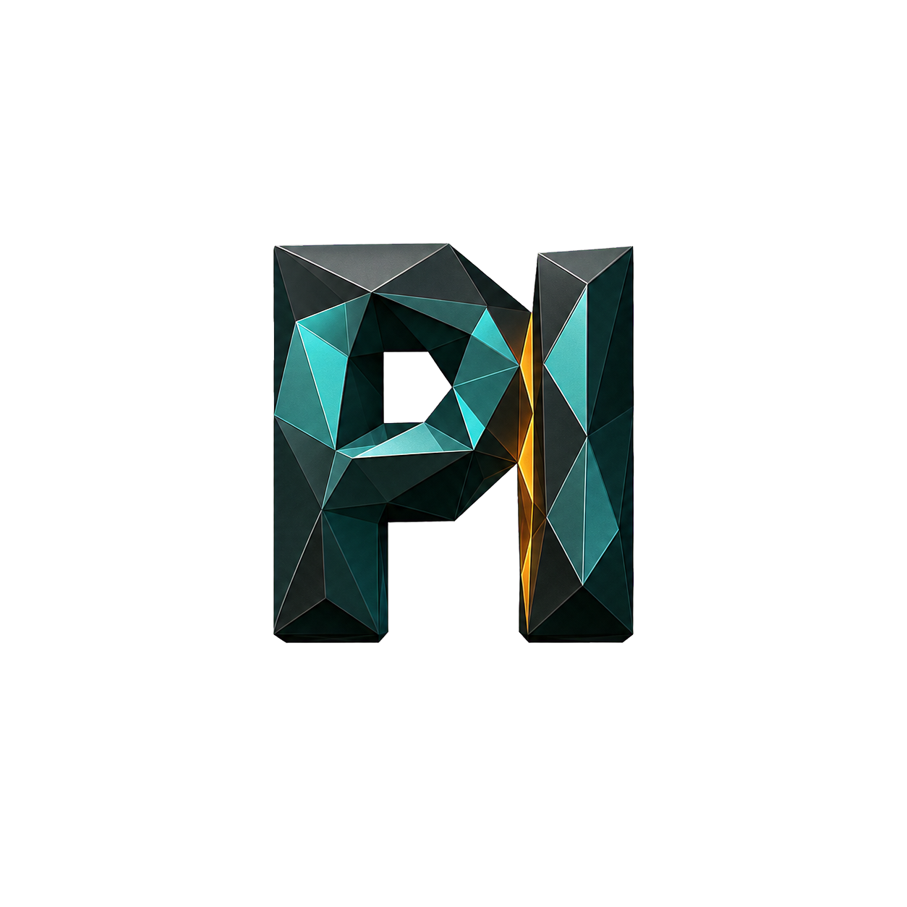

  

# pi

An opinionated collection of extensions, skills, and UI customizations for the [Pi coding agent](https://pi.dev).

## Highlights

- GitHub Dark Default theme
- Customized footer and model information
- Background terminals with an interactive process dashboard
- Subagents powered by Pi, Claude Code, and Codex
- Multi-agent workflows with phased orchestration
- First-class `fd` file discovery and `rg` content search tools
- Interactive questions with single-choice, multi-select, confirmation, and free-text modes
- Session summaries and compact recaps
- Optional Codex-backed image generation through an existing ChatGPT Plus/Pro login

## Structure

- `extensions/` — tools, UI integrations, subagents, and workflows
- `skills/` — model instructions for extension-specific workflows
- `themes/` — the included Pi theme
- `assets/` — README artwork and interface previews

See [`SETUP.md`](SETUP.md) for installation instructions.
